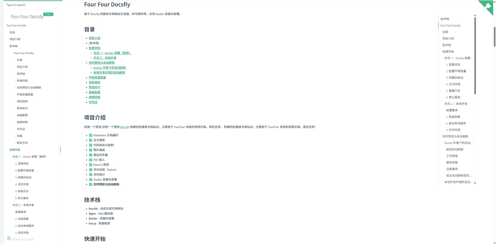

# Four Four Docsfiy

基于 Docsify 的静态文档网站生成器，所写即所得，支持 Docker 容器化部署。


## 目录

- [项目介绍](#项目介绍)
- [技术栈](#技术栈)
- [快速开始](#快速开始)
  - [方式一：Docker 部署（推荐）](#方式一docker-部署推荐)
  - [方式二：本地开发](#方式二本地开发)
- [实时预览与自动刷新](#实时预览与自动刷新)
  - [Docker 环境下的自动刷新](#docker-环境下的自动刷新)
  - [本地开发环境的自动刷新](#本地开发环境的自动刷新)
- [环境变量配置](#环境变量配置)
- [项目结构](#项目结构)
- [常用命令](#常用命令)
- [高级配置](#高级配置)
- [故障排查](#故障排查)
- [许可证](#许可证)

## 项目介绍

这是一个使用  [Docsify](https://docsify.js.org/#/?id=docsify) 构建的轻量级文档建站工具 。项目支持：

- ✅ Markdown 文档编写
- ✅ 全文搜索
- ✅ 代码高亮与复制
- ✅ 图片缩放
- ✅ 侧边栏折叠
- ✅ PDF 嵌入
- ✅ Draw.io 图表
- ✅ 评论系统（Valine）
- ✅ 访问统计
- ✅ Docker 容器化部署
- ✅ **实时预览与自动刷新**

## 技术栈

- **Docsify** - 动态生成文档网站
- **Nginx** - Web 服务器
- **Docker** - 容器化部署
- **Vue.js** - 前端框架

## 快速开始

### 方式一：Docker 部署（推荐）

#### 1. 克隆项目

```bash
git clone <your-repo-url>
cd fourfour-docsfiy
```

#### 2. 配置环境变量

复制环境变量示例文件：

```bash
cp .env.example .env
```

编辑 `.env` 文件，根据实际需求修改配置：

```env
DOCSIFY_NAME=fourfour-docsfiy
DOCSIFY_VERSION=2.20.1
DOCSIFY_BASE_PATH=docs/
AUTH_ENABLE=true
# ... 其他配置
```

#### 3. 构建并启动

```bash
docker-compose up -d
```

#### 4. 访问文档

打开浏览器访问：http://localhost:3000

#### 5. 查看日志

```bash
docker-compose logs -f
```

#### 6. 停止服务

```bash
docker-compose down
```

### 方式二：本地开发

#### 前置要求

- Node.js >= 14.x
- npm 或 yarn

#### 1. 安装依赖

```bash
npm install -g docsify-note-cli
```

#### 2. 启动本地服务

```bash
docsify s
```

#### 3. 访问文档

打开浏览器访问：http://localhost:3000

## 实时预览与自动刷新

### Docker 环境下的自动刷新

项目已内置文件监听和自动刷新功能，修改文档后无需手动刷新浏览器。

#### 启用自动刷新

1. 编辑 `.env` 文件，设置 `AUTO_RELOAD=true`：

```env
AUTO_RELOAD=true
```

2. 重启容器使配置生效：

```bash
docker-compose down
docker-compose up -d
```

3. 查看日志确认自动刷新已启用：

```bash
docker-compose logs docs
```

你应该看到类似输出：
```
Starting Docsify with auto-reload...
Auto-reload is enabled. Watching for file changes...
File watcher started with PID: xxx
```

#### 工作原理

- **文件监听器**：容器内每 1 秒检查一次 Markdown 文件变化
- **浏览器端检测**：前端脚本每 1 秒检查 `index.html` 的 Last-Modified 头是否有变化
- **自动刷新**：检测到变化后自动强制刷新浏览器页面（无需手动操作）
- **触发机制**：文件监听器检测到 `.md` 文件变化后，通过 `touch index.html` 更新其修改时间

#### 使用流程

```bash
# 1. 编辑文档
vim docs/README.md

# 2. 保存文件

# 3. 浏览器自动刷新，显示最新内容（无需任何操作）
```

#### 注意事项

- ✅ 仅在 `localhost` 或 `127.0.0.1` 环境下自动启用
- ✅ 生产环境建议关闭（`AUTO_RELOAD=false`）
- ✅ 对性能影响极小（每 1 秒检查一次）
- ✅ 需要现代浏览器支持 Fetch API
- ✅ 首次加载时会在控制台显示 "Auto-reload enabled for development"
- ✅ 检测到变化时会显示新旧 Last-Modified 值对比

#### 验证自动刷新是否工作

1. **查看容器日志**：
   ```bash
   docker-compose logs docs | grep -i "auto-reload\|watcher\|detected"
   ```
   应该看到：
   ```
   Auto-reload is enabled. Watching for file changes...
   File watcher started with PID: xxx
   ```

2. **打开浏览器控制台**（F12 → Console）：
   - 应该看到：`Auto-reload enabled for development`
   - 应该看到：`Initial Last-Modified: ...`

3. **编辑文档测试**：
   ```bash
   vim docs/README.md
   # 添加内容并保存
   ```
   
4. **观察三个地方**：
   - **容器日志**：`Detected changes in markdown files, triggering reload...`
   - **浏览器控制台**：`Page updated, reloading...` + 新旧时间戳对比
   - **浏览器页面**：自动刷新显示最新内容

5. **如果未生效，检查**：
   ```bash
   # 确认环境变量
   docker-compose exec docs env | grep AUTO_RELOAD
   
   # 检查文件监听器
   docker-compose exec docs ps aux | grep "while true"
   
   # 手动触发测试
   docker-compose exec docs touch /usr/share/nginx/html/index.html
   ```

### 本地开发环境的自动刷新

使用 `docsify s` 命令启动本地开发服务器时，也需要处理浏览器缓存问题。

#### 方法一：禁用浏览器缓存（推荐）

1. 打开浏览器开发者工具（F12）
2. 点击 **Network**（网络）标签
3. 勾选 **Disable cache**（禁用缓存）
4. 保持开发者工具打开状态
5. 修改文件后刷新页面即可看到更新

#### 方法二：强制刷新

- **Windows/Linux**: `Ctrl + Shift + R` 或 `Ctrl + F5`
- **macOS**: `Cmd + Shift + R`

#### 方法三：使用自动刷新扩展

安装浏览器扩展：
- **LiveReload** (Chrome/Firefox)
- **Auto Refresh Plus**

## 环境变量配置

| 变量名 | 默认值         | 说明 |
|--------|-------------|------|
| `HOST_PORT` | 3000        | 服务端口号 |
| `MAINTAINER` | four-docs | Docker 镜像维护者 |
| `DESCRIPTION` | four-docs   | Docker 镜像描述 |
| `AUTO_RELOAD` | false       | 是否启用自动刷新（开发模式） |
| `DOCSIFY_NAME` | FourFour Docsify | 文档站点名称 |
| `DOCSIFY_VERSION` | 2.20.1      | 版本号显示 |
| `DOCSIFY_BASE_PATH` | docs        | 文档基础路径（不含尾部斜杠） |
| `DOCSIFY_ROUTER_MODE` | hash        | 路由模式 (hash/history) |
| `DOCSIFY_SUB_MAX_LEVEL` | 5           | 侧边栏最大层级 |
| `DOCSIFY_SIDEBAR_DISPLAY_LEVEL` | 5           | 侧边栏显示层级 |
| `DOCSIFY_REPO` | (空)         | GitHub 仓库地址 |
| `BAIDU_TJ_ID` | (空)         | 百度统计 ID |
| `VALINE_APP_ID` | (空)         | Valine 评论 AppId |
| `VALINE_APP_KEY` | (空)         | Valine 评论 AppKey |
| `AUTH_ENABLE` | true        | 是否启用认证 |
| `AUTH_PASSWORD` | (空)         | 认证密码（MD5） |

### 配置示例

#### 禁用认证

```env
AUTH_ENABLE=false
```

#### 配置 Valine 评论系统

```env
VALINE_APP_ID=your_app_id
VALINE_APP_KEY=your_app_key
```

#### 配置百度统计

```env
BAIDU_TJ_ID=your_baidu_tj_id
```

## 项目结构

```
buzhile-help-docs/
├── docs/                  # 文档内容目录
│   ├── README.md         # 首页文档
│   ├── _coverpage.md     # 封面页
│   ├── _navbar.md        # 导航栏
│   ├── _sidebar.md       # 侧边栏
│   └── README.assets/    # 文档资源文件
├── static/               # 静态资源
│   ├── css/             # 自定义样式
│   └── icon/            # 网站图标
├── index.html           # Docsify 主配置文件
├── nginx.conf           # Nginx 配置文件
├── docker-entrypoint.sh # Docker 入口脚本
├── Dockerfile           # Docker 镜像构建文件
├── docker-compose.yml   # Docker Compose 配置
├── .env.example         # 环境变量示例
├── .dockerignore        # Docker 忽略文件
└── publish.sh           # 发布脚本
```

## 常用命令

### Docker 相关

```bash
# 构建镜像
docker-compose build

# 启动服务
docker-compose up -d

# 重启服务
docker-compose restart

# 停止服务
docker-compose down

# 查看日志
docker-compose logs -f

# 进入容器
docker-compose exec docs sh

# 查看容器状态
docker-compose ps
```

### 文档更新

#### 开发模式（推荐）

1. 在 `docs/` 目录下编辑或新增 Markdown 文件
2. 更新 `_sidebar.md` 添加新文档链接
3. **如果启用了 `AUTO_RELOAD`**，浏览器会自动刷新显示最新内容
4. **如果未启用自动刷新**，手动刷新浏览器即可（F5）

#### 生产模式

1. 修改文档文件
2. 重新构建并部署：

```bash
docker-compose down
docker-compose up -d --build
```

## 高级配置

### 自定义端口

编辑 `docker-compose.yml`，修改端口映射：

```yaml
ports:
  - "8080:80"  # 将 3000 改为你想要的端口
```

### 生产环境部署

#### 使用 Docker Hub

```bash
# 构建并标记镜像
docker build -t yourusername/buzhile-docs:latest .

# 推送到 Docker Hub
docker push yourusername/buzhile-docs:latest

# 在其他服务器拉取并运行
docker run -d -p 3000:80 --env-file .env yourusername/buzhile-docs:latest
```

#### 使用 Nginx 反向代理

```nginx
server {
    listen 80;
    server_name docs.yourdomain.com;

    location / {
        proxy_pass http://localhost:3000;
        proxy_set_header Host $host;
        proxy_set_header X-Real-IP $remote_addr;
        proxy_set_header X-Forwarded-For $proxy_add_x_forwarded_for;
        proxy_set_header X-Forwarded-Proto $scheme;
    }
}
```

### HTTPS 配置

使用 Let's Encrypt 免费证书：

```bash
# 安装 certbot
sudo apt-get install certbot python3-certbot-nginx

# 获取证书
sudo certbot --nginx -d docs.yourdomain.com
```

## 故障排查

### 容器无法启动

```bash
# 查看详细日志
docker-compose logs docs

# 检查配置文件语法
docker-compose config
```

### 文档不显示

1. 检查 `docs/` 目录下是否有 `README.md` 文件
2. 检查 `_sidebar.md` 配置是否正确
3. 查看浏览器控制台是否有错误信息
4. 清除浏览器缓存或强制刷新（Ctrl+Shift+R）

### 自动刷新不生效

1. 确认 `.env` 文件中 `AUTO_RELOAD=true`
2. 重启容器：`docker-compose down && docker-compose up -d`
3. 查看日志确认：`docker-compose logs docs`
4. 确保访问地址是 `localhost` 或 `127.0.0.1`
5. 打开浏览器控制台查看是否有 "Auto-reload enabled" 日志

### 文件修改后页面未更新

1. **检查卷挂载是否生效**：
   ```bash
   docker exec -it fourfour-docs ls -la /usr/share/nginx/html/docs/
   ```

2. **清除浏览器缓存**：
   - 打开开发者工具（F12）
   - Network 标签 → 勾选 "Disable cache"
   - 强制刷新页面（Ctrl+Shift+R）

3. **检查 Nginx 缓存配置**：
   - 确认 `nginx.conf` 中 Markdown 文件已配置不缓存

### 环境变量不生效

1. 确保 `.env` 文件在 `docker-compose.yml` 同级目录
2. 重新构建容器：`docker-compose up -d --build`
3. 检查环境变量是否正确传递：`docker-compose exec docs env`

## 许可证

本项目采用 MIT 许可证。详见 [LICENSE](LICENSE) 文件。

## 贡献

欢迎提交 Issue 和 Pull Request！

## 联系方式

如有问题，请通过以下方式联系：

- 提交 Issue
- 发送邮件至：383781284@qq.com

---

**FourFourDocsfiy** - 不好意思，让您贱笑了，希望您的文档管理更简单 🚀

